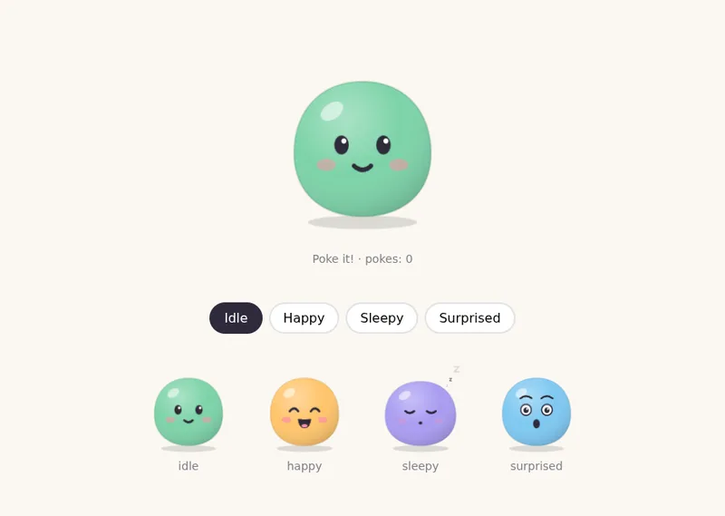
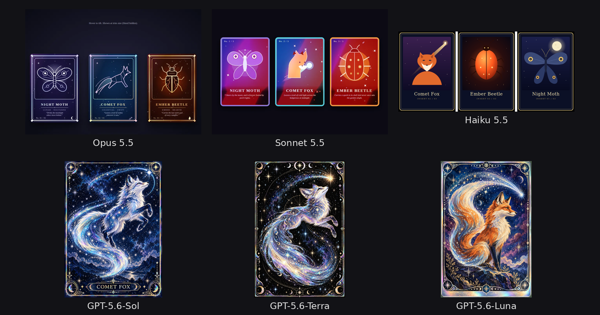

# Prompt Receipts

[](https://github.com/musharna/prompt-receipts/actions/workflows/test.yml) [](LICENSE)

Prompts for making things with Claude Code and Codex, each shown with a receipt: what it cost, how long it took and what was switched on. Plus a script that prints the same receipt for your own runs in Claude Code, Codex, OpenCode, Qwen Code, Gemini CLI or GitHub Copilot CLI.

**[Browse the prompts](https://musharna.github.io/prompt-receipts/)** · **[Make a receipt for your own run](#make-a-receipt-for-your-own-run)** · [What's new](CHANGELOG.md)

```
$ python3 receipt.py --prompt
Receipt v5.0 · Claude Code 2.1.292 · 6 Oct 2026, 8:16 PM EDT · no. 5631-4887
model    claude-opus-5-5 · effort medium
time     4 min (model working 4 min) · 1 prompt from me
cost     $0.83 (Claude Code's own total at API prices; the lines below add up to it)
         claude-opus-5-5
           input                  18 × $4.00/M   <$0.01
           cache read           273k × $0.20/M    $0.05
           cache write (1 h)     33k × $8.00/M    $0.27
           output               25k × $20.00/M    $0.51
extras   thinking 2 min · waiting on retries <1 s
prices   API list prices per million tokens ($/M), from LiteLLM 05166e2, 9 Oct 2026
billing  Max plan: a flat fee, not charged per run (your account today)
tokens   in 306k (273k cached) · out 25k
work     13 tool calls, 6 shell commands · web 0 · lines +537 -0
files    2 files written or edited (.html, .js)
add-ons  skills none (of 14 available) · MCP none (of 0 connected) · plugins none · subagents 0
hooks    none logged
memory   none loaded
settings bypassPermissions
id       680b62f5e76e (prompt fingerprint)
prompt   A mascot for my habit-tracker app: a round blob that breathes, blinks and
         giggles when you poke it. I'd like it in four moods: idle, happy, sleepy and
         surprised.
```

<a href="https://musharna.github.io/prompt-receipts/play/1bfe1ef0-9a8/index.html"></a>

That's plain Opus 5.5 making [this blob mascot](https://musharna.github.io/prompt-receipts/play/1bfe1ef0-9a8/index.html) from one of the site's prompts. See [the other models' versions](https://musharna.github.io/prompt-receipts/#1bfe1ef0-9a8), or [this receipt on the site](https://musharna.github.io/prompt-receipts/r/#r1.ZVNBbtswELzrFXsIEBu1FUmOZCfNpUh7KBCjQdEPUNLKYk2RgkjF8Uv6lN7bj3VIOY3b6GCLS452ODP7lSuWvaOnPE7o10-6V2Ksme4NfrI4jbObzJcL-lI5ypKsWNDmNi3ocUufPn7zW9rElBerdHm92ayjDkBFeKrwoaXpR7vMl7k_yU1jBkcd13LsIic79gfpmjqpaTYhD2bYS72binOPSqkfTAeKDf4AjipjXQBeJPFmRbMzypeWzEGTM04oEo4-PH4GWlZs35NrmZTUbKlkZQ4k6prGHmdJunlEL89_vF83iKTuR0dvnnRDv3_QxXWcJFdbrO_AK0nPgZWo0HxgUZ8Vs_VqH4BJnE1A_5rkb4GHQTqmWUrtPFRXJ-DmpWP4xvocaEb3lmuWT7gsOQfmacTPbhAWS9dKHeTPgidQ_yCk8wWjwd8NEvLdpWSjSVVAvMRKwpFTpecBWKWk8T7sWVuaXVxt54vJvwdc5eFhS0meFgVnC7r5m6yo9DD0oq14pl4JfUuCGgUfG-YFguaoasWw4zp0GUak5mjGgURVmVE79KvFcR6d2nrDaJUUe5oFrYOYdcgU5PFqRD5tk4crgI3CGaXsAnG3LSssTdcJXdugBJcURmQK0bt8taZlEjVSBR0g2fTq3XKsyQyEoDuQncWt69SC4u92HiF2S-PZ2T2ua3ErDW9NQ-k1iSchlSgVB5Lb-8fX3QRctObKnW7Qq3En9QmOtR1LsWPtLCVRa8w-UAqbyuygWNRxZ4bja1HUKFp23l2MxLEX1j7y0ElrYZ2N5EtWi01SFlmT87oAlZdZBIoHWK4xO6caskCdsBVswpxTd6RWlNItka1qD79E33tDB1hVU6lMibjB2xJzgdmE6iWUBXEI_hrlndztgqotJIXZ1MNcTGxMny9rWBEW3ujGB6Ezpra3JGuFvLRoeFyQVcz98d-v2tFzt1zHfwA), made with `--link`.

<br clear="right">

## Make a receipt for your own run

In the folder where you ran Claude Code:

```
curl -sO https://musharna.github.io/prompt-receipts/tools/receipt.py && python3 receipt.py
```

On Windows, in PowerShell:

```
curl.exe -sO https://musharna.github.io/prompt-receipts/tools/receipt.py; py receipt.py
```

Or install it as a command, `receipt` (also `prompt-receipts`):

```
uvx --from git+https://github.com/musharna/prompt-receipts receipt      # run it without installing
pipx install git+https://github.com/musharna/prompt-receipts            # or keep it installed
```

It needs only Python 3.9 or later. It reads the logs these tools already keep, so it works on runs you've already finished:

| Tool | Add | Logs it reads |
|---|---|---|
| Claude Code | nothing | `~/.claude/projects/`, or under `$CLAUDE_CONFIG_DIR` |
| Codex | `--codex` | `~/.codex/sessions/`, or under `$CODEX_HOME` |
| OpenCode | `--opencode` | `~/.local/share/opencode/opencode.db`, or under `$XDG_DATA_HOME` |
| Qwen Code | `--qwen` | `~/.qwen/projects/`, or under `$QWEN_HOME` |
| Gemini CLI | `--gemini` | `~/.gemini/tmp/`, or under `$GEMINI_CLI_HOME` |
| GitHub Copilot CLI | `--copilot` | `~/.copilot/session-state/`, or under `$COPILOT_HOME` |

Run it somewhere else and it tells you where your sessions are; `--list --all` lists them from every folder.

### Common uses

```
python3 receipt.py --list                  # this folder's recent sessions, numbered
python3 receipt.py --pick 2 --prompt       # a receipt for one of them, with your prompts
python3 receipt.py --hide cost --link      # leave out the cost and print a link to share
python3 receipt.py --turns --recipe        # a line per prompt, and the commands to rerun them
python3 receipt.py --out receipt.png       # a picture, for posting where text gets mangled
python3 receipt.py --totals week --all     # cost, prompts and time by week, every folder

python3 receipt.py --json --prompt-id --out opus.json      # save one receipt per model,
python3 receipt.py --compare opus.json sonnet.json         # then set them side by side
```

### What it shares

- `receipt.py` itself never connects to the internet. It reads local files and prints text.
- It never prints paths, your email, account ids or file contents. Your prompts and the model's reply appear only when you ask (`--prompt`, `--reply`, `--recipe`), and it stops if one holds an email address or a key.
- `--link` puts the receipt after the `#` in the link, which browsers never send, so nothing is uploaded.
- `--bundle` packs the files a run wrote, and `--page` puts your prompts, the model's replies and those files on one page, only when you ask. Their text is checked for email addresses and keys like `--prompt`.
- `--output-url` only names where you'll put the page; `receipt.py` uploads nothing. The receipt site fetches it from there when someone opens the receipt.
- Read the receipt before you share it. Prompts, tool names and times can say more than you mean to.

### Choosing what it covers

| Option | What it does |
|---|---|
| `--codex`, `--opencode`, `--qwen`, `--gemini`, `--copilot` | Use that tool's sessions instead of Claude Code ones |
| `--list`, then `--pick N` | List this folder's recent sessions, then make a receipt for one of them |
| `--all` | With `--list` or `--pick`: sessions from every folder |
| `--last N` | Cover only your last N prompts, when one session held several tasks |
| `--turns A-B` | Cover only prompts A to B (`3`, `3-5`, `3-` or `-5`). Its cost is worked out from those prompts' calls |
| `SESSION.jsonl` or `ses_…` | Make a receipt for a log file, or an OpenCode session id, directly |

### Leaving things out

| Option | What it does |
|---|---|
| `--hide cost,date` | Drop parts: version, date, model, time, cost, items (the priced lines), billing, tokens, work, files, output (the size of what it wrote and the replies), addons, hooks, memory, settings. Hiding the model or the cost hides the priced lines too, since they name both |
| `--counts` | Show numbers instead of the names of skills, MCP servers, plugins, subagent types and memory files |
| `--rename old=new` | Show one name as another. Stops with an error if the name isn't on the receipt, so a typo can't leave the real one in |
| `--prompt` | Add your prompts, each one numbered. Home folders become `~`, and it stops if a prompt holds an email address or a key |
| `--redact` | With `--prompt`, `--reply`, `--recipe` or `--outcome`: print the text with `[email]` and `[key]` in their place instead of stopping |
| `--file-names` | Name the files the run wrote. Off by default: the receipt shows only how many and their types |

### Prompt by prompt

| Option | What it does |
|---|---|
| `--turns` | Add a line per prompt: when you sent it, how long it ran, its cost (subagents included), tool calls and files. The receipt says whether the lines add up to the cost above |
| `--reply` | Add the model's last reply, checked for email addresses and keys like a prompt |
| `--outcome TEXT` | Add your own word on how it went, marked as yours |
| `--recipe` | Add the commands that send the same prompts again, each with the model and effort it ran on (`claude -p`, `codex exec`, `opencode run`, `qwen`, `gemini -p`, `copilot -p`). Models give a different answer each time, so it reruns the run, not its output |

### Saving and sharing

| Option | What it does |
|---|---|
| `--md`, `--json` | Wrap it for GitHub or Discord, or print it as JSON (hidden parts stay out) |
| `--out FILE` | Save it to a `.txt`, `.md`, `.json` or `.png` file, or into a folder. A `.png` is a picture, for posting where text gets mangled |
| `--report` | Also print a link to [the report form](https://musharna.github.io/prompt-receipts/) with this receipt filled in |
| `--link` | Also print a link that shows this receipt on the site. The receipt rides in the part after `#`, which your browser never sends, so nothing is uploaded. Long receipts make links too long for some chats; it warns over 2,000 characters |
| `--bundle FILE.zip` | Save one zip with the receipt, its JSON, a record, and the files the run wrote, plus [RO-Crate](https://www.researchobject.org/ro-crate/) metadata and a page that shows the receipt |
| `--shot` | With `--bundle`: add a screenshot of the web page the run made, taken with Chrome, Edge or Chromium if one is installed. It shows the files in the bundle, served to the browser from your own computer only while the picture is taken; pictures the run didn't make aren't in it |

### What the run made

Every receipt says how much the run wrote: `files    3 files written or edited (.html, .js ×2) · 612 lines, 24 KB · a web page`, and `replies  4 replies, 1,180 words`. No names or text.

| Option | What it does |
|---|---|
| `--page FILE.html` | Save one page with the receipt, every prompt and the model's full replies, and each file the run wrote. A web page the run made runs inside it, in a sandboxed frame, with the .js, .css and pictures it uses from the run put inside, so the one file works anywhere. Text files are shown as the run wrote them, or as they are on disk now when only edited. With `--redact`, emails and keys are replaced instead of stopping |
| `--output-url URL` | With `--page`: say where you'll put the page (an `https://` address, such as a GitHub Pages site). The receipt gets a `page` line with the address and the start of the page's SHA-256. When someone opens the receipt's `--link`, the site fetches the page, checks it, and shows it only if it matches byte for byte. Upload the file unchanged; the site where it lives must let other sites read it, as GitHub Pages and raw.githubusercontent.com do |

```sh
python3 receipt.py --page run.html --output-url https://you.github.io/runs/run.html --link
```

### More than one run

| Option | What it does |
|---|---|
| `--compare A.json B.json` | Set receipts side by side, for one prompt run on several models or efforts |
| `--prompt-id` | Add a short fingerprint of the prompt (not the prompt itself), so `--compare` can tell runs of one prompt |
| `--combine A.json B.json` | Add up receipts for one task spread over several sessions |

### Totals over time

`--totals` adds up every prompt in this folder's sessions (every folder's with `--all`), by `day`, `week`, `month`, `folder` or `model`:

```
$ python3 receipt.py --gemini --totals
Totals v6.0 · Gemini CLI · folder gwork · 9 Oct 2026 · by day
day              cost  sessions  prompts  time  tokens in / out
Fri 9 Oct 2026  $0.01         1        2  <1 s        62k / 312
---------------------------------------------------------------
total           $0.01         1        2  <1 s        62k / 312
```

| Option | What it does |
|---|---|
| `--totals [BY]` | Add up cost, sessions, prompts, time and tokens by day (the default), week, month, folder or model. Each prompt's cost is worked out from its own calls at API list prices |
| `--since DATE`, `--until DATE` | Count only prompts sent on or after, or on or before, a date (`2026-10-01`) |

`--json`, `--md`, `--out` and `--link` work on totals too.

### A record of what went in and came out

A receipt says what a run cost. A record says which files it made and what it was given, as SHA-256 fingerprints, so anyone holding a file can check whether it came out of that run. It holds no prompts, file contents or paths: only fingerprints of your prompts, the system prompt, the instruction files as they were loaded (`CLAUDE.md`, `AGENTS.md`), every tool result the model saw, and the files it wrote, plus the model, effort, settings and, for Codex, the git commit.

| Option | What it does |
|---|---|
| `--record FILE` | Save a record of the run. Its fingerprint goes on the receipt. `--hide`, `--counts`, `--rename` and `--file-names` apply to it too |
| `--verify RECORD FILES…` | Say for each file whether it came out of the run, went into it, or isn't in the record. One changed byte and it isn't |
| `--sign KEY` | Sign the receipt (`--out`) and the record with an SSH key (`ssh-keygen -Y sign`); the signature goes next to each as `.sig` |
| `--verify FILE` | Check the signature next to a receipt or record. Add `--signers allowed_signers` to check whose key signed it |
| `--prices FILE` | Price with a newer copy of LiteLLM's `model_prices_and_context_window.json` instead of the one built in |

A record is in-toto's [Statement](https://github.com/in-toto/attestation/blob/main/spec/v1/statement.md) format, written in one byte form (sorted keys, no spaces), so its fingerprint is the same wherever it's made. It makes a run checkable, not repeatable: neither tool lets you fix the model's randomness. Records of short prompts can be guessed by trying likely prompts, and a signature made after the run proves only what the log said when it was signed.

### A receipt after every Claude Code session

Put this in `~/.claude/settings.json` (merge it with any `hooks` you already have) and every session leaves a receipt in `~/receipts` when it ends:

```json
{
  "hooks": {
    "SessionEnd": [
      { "hooks": [{ "type": "command", "command": "python3 ~/receipt.py --hook --out ~/receipts/" }] }
    ]
  }
}
```

Keep `receipt.py` in your home folder for this, or change the path. Sessions with no prompts leave no receipt.

### Plan use on the status line

On a Pro or Max plan, Claude Code tells the status line how much of your 5-hour and weekly limits you've used. `--statusline` shows that, and keeps the readings so a receipt made later can say how much of your plan a run took:

```json
{ "statusLine": { "type": "command", "command": "python3 ~/receipt.py --statusline" } }
```

```
Opus 5.5 · $0.28 · 3 s · 5-hour 2% · weekly 51%
```

Receipts for sessions that ran with it get a `limits` line, such as `5-hour +7%, weekly +2% while this ran`. Other sessions running at the same time count toward the same limits, so the receipt says so. The readings are kept in `~/.cache/prompt-receipts/limits/` (under `$XDG_CACHE_HOME` if set, `%LOCALAPPDATA%` on Windows), only when a number changes. To keep the status line you have, call both from one script, passing each the same input:

```sh
#!/bin/sh
input=$(cat)
echo "$(echo "$input" | ~/.claude/my-statusline.sh) · $(echo "$input" | python3 ~/receipt.py --statusline)"
```

### Good to know

- Claude Code deletes session logs after 30 days unless you raise `cleanupPeriodDays` in `~/.claude/settings.json`. Logs can be large, so check your free disk space before raising it a lot.
- If you moved a tool's folder with `CLAUDE_CONFIG_DIR`, `CODEX_HOME`, `XDG_DATA_HOME`, `QWEN_HOME`, `GEMINI_CLI_HOME` or `COPILOT_HOME`, the receipt looks there.
- For a whole Claude Code session, the cost and tokens are Claude Code's own totals and include subagents, added up over every time the session was opened. The lines under the cost price each call at API list prices, and the receipt says whether they add up to Claude Code's total or by how much they miss; long sessions that were compacted many times can miss. With `--last`, the cost is worked out from that part's calls.
- A Claude Code session resumed into a new log file gets its own receipt; `--combine` adds them up.
- Codex, Qwen Code, Gemini CLI and Copilot CLI don't log a price, so their cost is worked out from their token counts at API list prices (Alibaba Cloud's for Qwen models, Google's for Gemini). OpenCode's own figure is used when it has one. The built-in prices are LiteLLM's, dated on the receipt; `python3 tools/update_prices.py` refreshes them.
- What you pay can differ from list prices. Qwen OAuth's free allowance isn't charged; Copilot bills a plan's premium requests or AI credits, and the receipt shows the AI credits when the log has them; a key for a service like OpenRouter is charged at that service's prices.
- Qwen Code's background helpers (its memory extractor) make API calls of their own. They are counted, since Qwen Code logs them.
- `--record` and `--bundle` cover all six tools. Files made by shell commands aren't in a bundle or on a page.
- The billing line reads your account as it is today, so it shows your plan now, not necessarily when the run happened. A run on a local model (Ollama, LM Studio) says so on the model line.
- Files count what the edit tools wrote, subagents' included. Files made by shell commands aren't counted, and what subagents read isn't in a record.
- With `--turns`, some background work Claude Code prices itself (titles, summaries) logs no calls, so no prompt can hold it; the receipt says how much it is. A session that's still running keeps writing its log, so its numbers can move a little between runs.
- Codex logs don't record hooks, and OpenCode's, Qwen Code's, Gemini CLI's and Copilot CLI's record neither hooks nor memory files. Gemini CLI logs no version, effort or approval setting either. Claude Code logs a hook run only when the hook prints something, so hook counts are a floor.
- If a log has your prompts but no replies or token counts, the receipt says so: the tool may have changed how it writes logs. Please [open an issue](https://github.com/musharna/prompt-receipts/issues).
- Checked on Linux, macOS and Windows (Python 3.9 and 3.13) on every change, and by hand on WSL and Windows 11.
- A receipt is text you can edit. It shows what someone reports, not proof, unless it's signed by a key you trust.

## The prompts

[](https://musharna.github.io/prompt-receipts/)

Each prompt on [the site](https://musharna.github.io/prompt-receipts/) was run once on plain Claude Code (Opus, Sonnet and Haiku 5.5) and on GPT-5.6 Sol, Terra and Luna in Codex, all at medium effort, plus GPT-6-Astra, Codex's default model. Every run shows what came out, what it cost and how long it took.

Tried one? Use the "Tell us how it went" button on its card. Runs that didn't work are as useful as ones that did.

## License

The code (`tools/receipt.py`, the tests and the site's scripts) is MIT: see [LICENSE](LICENSE). Prompts and page text are CC BY 4.0: see [LICENSE-prompts](LICENSE-prompts). The outputs were made by the models named on each card.
